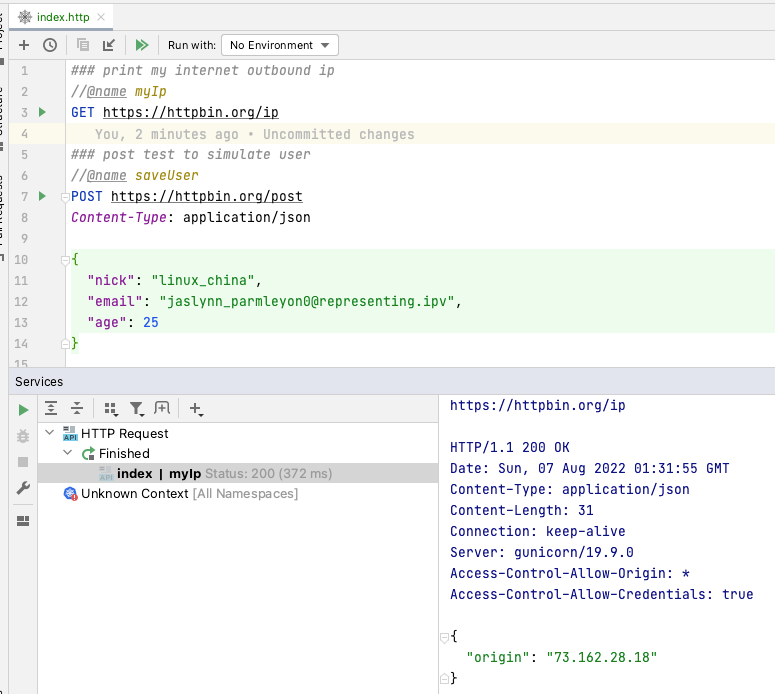

在日常开发中，调用HTTP REST API或者GraphQL服务，这些都是少不了的，毕竟大多数应用还是要和网络服务进行交互的。
如果你使用JetBrains IDE或者VS Code，最简单的方式就是创建一个`index.http`文件，然后在IDE中点击一下就可以运行并看到对应的测试结果。



在没有打开IDE的情况下，你还可以使用httpx命令行进行测试。如果要修改一下测试的数据，直接打开http文件，数据修改后再点击一下按钮运行即可，非常方便。

虽然服务测试这些都完成啦，但是你还有至关重要的代码没有写，当然这些代码并不难，如你使用fetch，样例代码如下： 

```javascript
const data = {
    "nick": "linux_china",
    "email": "jaslynn_parmleyon0@representing.ipv",
    "age": 25
};
const response = await fetch('https://httpbin.org/post', {
    method: 'POST',
    headers: {
        'Content-Type': 'application/json',
    },
    body: JSON.stringify(data),
})

console.log(await response.json());
```

当然有些同学说我要使用axios，这样的HTTP Client非常多，就看你的个人喜好啦。代码虽然不多，也不复杂，但是还有一定的工足量，而且这些代码看起来都像是重复代码。

能否有一种更好的方法，能否基于http文件自动完成这些格式代码的生成？ 如果能像esbuild的loader那样，直接引用就可以啦，样例代码如下： 

```javascript
import {myIp} from "./index.http";

let response = await myIp();
console.log(await response.json());
```

上述的代码简单明了多啦，我们根本不用关系HTTP通讯的细节，使用fetch还是axios，也不要写那么多重复的代码，完全就是一个函数调用就搞定啦。
如果http文件中对应的请求包括变量，那么我们只要在请求时将这些变量传入即可，如下：

```javascript
import {postTest} from "./index.http";

response = await postTest({nick: "test", host: "httpbin.org", "uuid": "c8389930-1071-4b88-9676-30b9ba7f2343"});
console.log(await response.json());
```

最后我们只要在esbuild配置代码中添加一下httpfile对应的esbuild plugin，这样就可以自动完成http文件到JavaScript代码的转换，如下：

```javascript
import esbuild from 'esbuild';
import httpfilePlugin from 'esbuild-plugin-httpfile';

esbuild.build({
    bundle: true,
    entryPoints: ['hello.mjs'],
    plugins: [httpfilePlugin(true)],
    platform: 'node',
    format: "esm",
    write: true,
    outfile: "bundle.mjs"
}).then(result => {
    console.log(result.outputFiles[0].text);
}).catch(() => process.exit(1));
```

当然背后的原理也不复杂，就是esbuild的自定义loader，在import http文件时自动完成http文件到JavaScript代码的转换，非常多的esbuild plugin也都是这样做的。

借助该方式，我们测试服务简单啦，在IDE中点击一下就可以，当然命令行也能测试，此外该http文件还可以做为其他JS文件的module，负责处理http通讯的细节，可谓是一鱼多吃。

此外这种方式排查问题也方便，如果服务调用有问题，你只要打开http文件测试一下就可以，而不是像之前那样去看应用中的JavaScript代码，如果涉及代码调整，还要涉及反复的单元测试。

此外使用这种http文件loader方式，还可以很好地解决请求Mock的问题。如用户登录的API还没有开发完成，但是你要在程序要使用该接口，你不需要改任何代码，
你只要在http文件中对应的请求添加`//@mock `tag，表示请求时直接返回该模拟数据，样例如下： 

```
### user login
//@name login
//@mock {"success": true}
POST https://your_domain_com/user/login
Content-Type: application/json

{
  "nick": "your_nick_name",
  "password": "123456"
}
```

如果是多行数据，添加多个`//@mock `tag，如下： 

```
### get csv data
//@name myData
//@mock name,gender
//@mock linux_china,M
GET https://your_service/data
Accept: text/csv
```

当REST API上线后，你只要将请求中的`//@mock `tag删除即可，这样就可以正常的调用REST API了。
**Note**: 如果在上线前你忘记删除`//@mock `tag也没有关系，如果`process.env.NODE_ENV`的值为`production`，mock是会被忽略的。

esbuild的httpfile插件地址： https://github.com/servicex-sh/esbuild-plugin-httpfile
目前整合esbuild的框架非常多，这些框架都可以使用该插件。 如果是其他框架，也可以自己集成，并不复杂，
另外可以参考Rollup的httpfile插件，地址为： https://github.com/servicex-sh/rollup-plugin-httpfile
