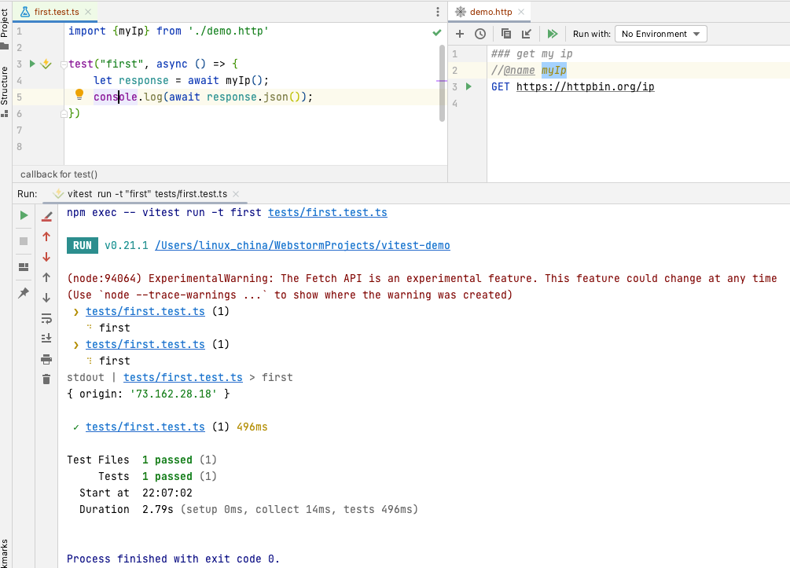

在esbuild-plugin-httpfile和rollup-plugin-httpfile发布后，Vite的httpfile插件也发啦，这样众多使用Vite的框架将都可以直接import httpfile。

详细的介绍和使用请参考： https://github.com/servicex-sh/vite-plugin-httpfile
这里给出一个Vitest测试直接import httpfile的截屏：

