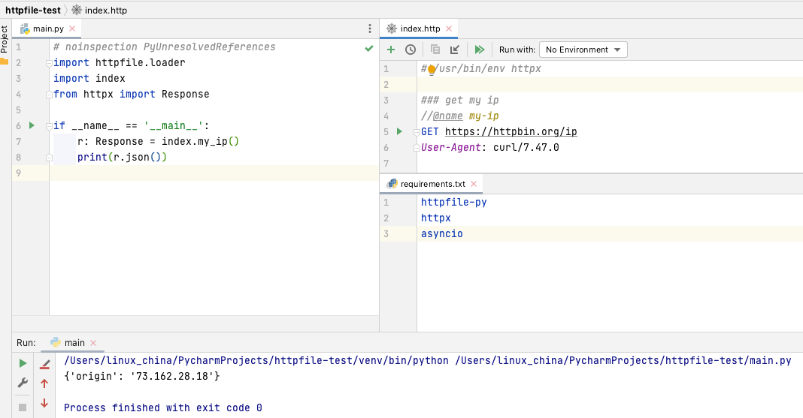

在esbuild, Rollup.js, Vite.js, webpack完成对httpfile直接import支持后，httpfile-py也跟着到来啦，你也可以直接在Python代码中直接import http文件，先看代码：

```python
import httpfile.loader
# noinspection PyUnresolvedReferences
import httpbin
from httpx import Response

if __name__ == '__main__':
    r: Response = httpbin.my_ip()
    print(r.json())
```

当然你要引入`httpfile-py`开发包，你可以在requirements.txt直接添加一下`httpfle-py`即可。
首先就是在要Python文件开头添加`import httpfile.loader`，这个主要时就是一个Python import的自定义hook，用于支持http文件的import。
接下来就是导入具体的http文件，如`import httpbin`就表示导入`httpbin.http`文件，该http文件会包括具体的http请求，代码如下：

```
### get my ip
//@name my-ip
GET https://httpbin.org/ip
User-Agent: curl/7.47.0

### post test
//@name post-test
POST https://{{host}}/post
User-Agent: curl/7.47.0
Content-Type: application/json

{
  "name": "{{nick}}",
  "age": 42,
  "uuid": "{{$uuid}}",
  "demo": "hi` morning"
}
```

接下来就是调用指定的http请求，如`r: Response = httpbin.my_ip()`，其中`my_ip`就是http文件中对应的请求名称，
而r对应的类型为`Response`，这个其实就是Python httpx开发包的`from httpx import Response`类型，httpfile-py背后使用httpx作为HTTP Client。

最后就是调用Response提供的方法，如`r.json()`表示返回json数据类型，然后就可以操作返回的数据了，看一下最终的效果截屏：



考虑到Python的异步Async支持，如果你想调用异步的http请求，只要在请求名称添加上`async_`前缀，如`async_my_ip()`，就表示调用异步的http请求，样例代码如下：

```python
import httpfile.loader
# noinspection PyUnresolvedReferences
import index
import asyncio
from httpx import Response


async def my_ip():
    r: Response = await index.async_my_ip()
    print(r.json())


if __name__ == '__main__':
    asyncio.run(my_ip())
```

**注意**：不要忘记添加`asyncio`package。

最后项目地址： https://github.com/servicex-sh/httpfile-py 欢迎Issue和PR。
