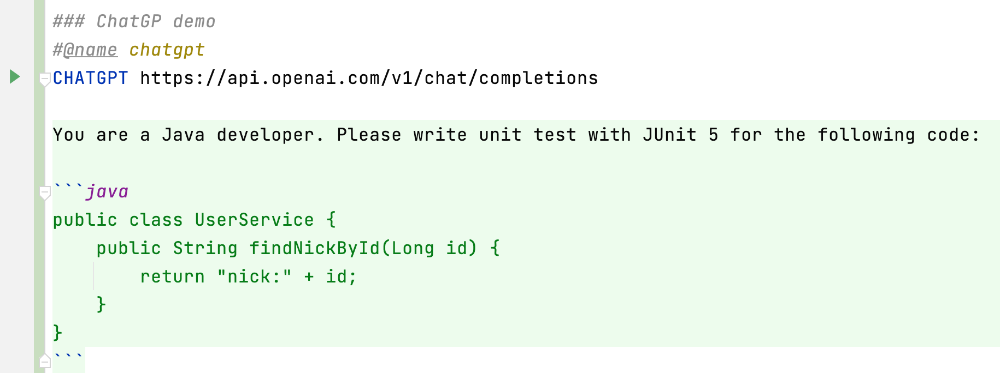

越来越多的同学开始陆续使用ChatGPT服务，它可以极大地提升开发者的工作效率，所以我们也在httpx中增加了对ChatGPT的支持，样例代码如下：

```
### ChatGP demo
#@name chatgpt
CHATGPT https://api.openai.com/v1/chat/completions
X-OPENAI-API-KEY ${OPENAI_API_KEY}

You are a Java developer. Please write unit test with JUnit 5 for the following code:

```java
public class UserService {
    public String findNickById(Long id) {
        return "nick:" + id;
    }
}
```

在使用ChatGPT的过程中，目前有一个不太好的用户体验，就是如何输入多行文本，同时在这些内容中还要添加对应的代码，如果你只使用ChatGPT的聊天输入框，这个问题相对来说就比较难解决啦。
一不留神就将不完全的内容发送出去啦，另外就不要说代码输入这些问题，基本上是不可能的，所以很多开发人员都在JetBrains IDE或者VS Code中提前输入好这些内容，然后再复制到ChatGPT的聊天输入框中，
进行查询，虽然能工作，但是浪费了不少时间。

httpx 0.41版本中增加了ChatGPT的支持，你只要在http文件中使用`CHATGPT` method，当然查询的内容就是HTTP Body，不同的时这里默认将Markdown作为输入内容格式，这样你可以非常方便地输入文本和代码，
而且还有对应的代码高亮，截屏如下：



通过这种方式，你非常容易进行多行文本和代码的输入，然后点击一下运行按钮就可以进行ChatGPT查询。我们都知道ChatGPT API返回的内容为JSON格式，考虑到阅读的方便，我们需要将返回结果中的答案提取出来，
然后放到返回结果后面进行显示，这样主要是方便阅读，截屏如下：


通过这种方式，你可以非常容易编写Prompt，然后进行测试，然后再进行调整，最后确保Prompt的质量，这个也是Prompt Engineering所提倡的。

**提示**: 如果你已经设置了`OPENAI_API_KEY`环境变量，那么你就可以不需要设置`X-OPENAI-API-KEY` HTTP头。


