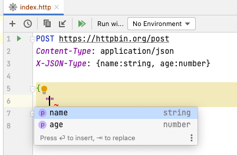
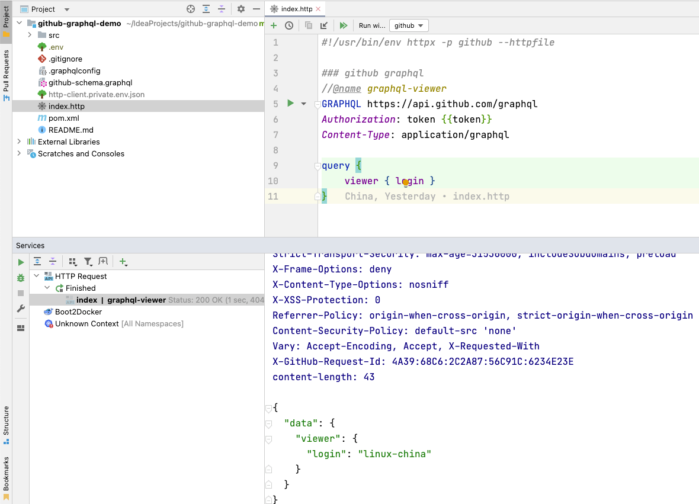
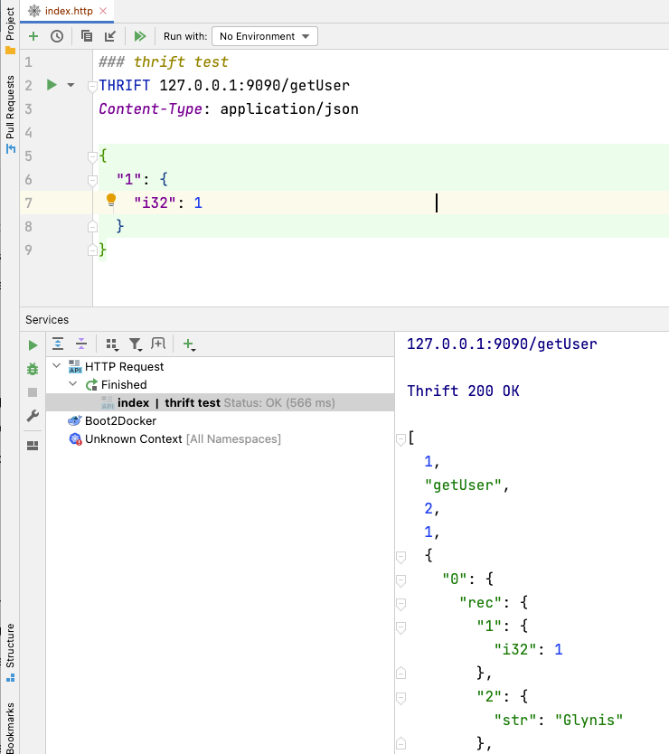
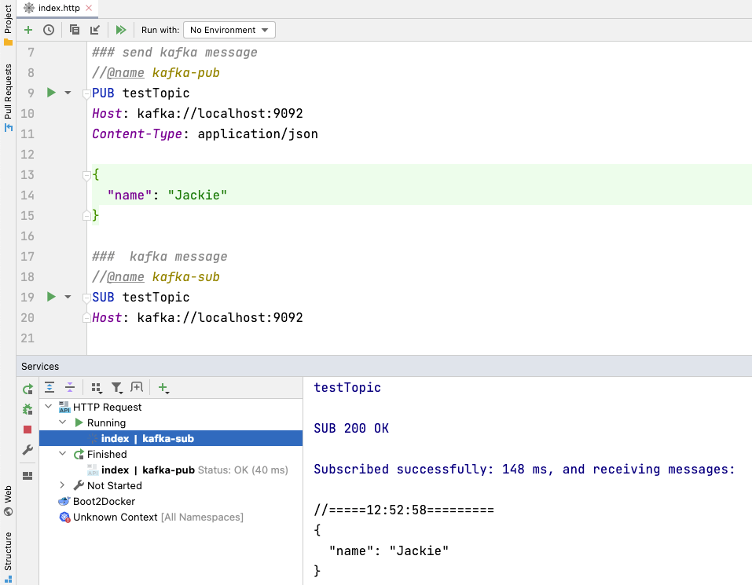

# Httpx JetBrains Plugin

Httpx JetBrains plugin is based on JetBrains HTTP Client, and it's a very powerful.
If you don't know about it, please click https://www.jetbrains.com/help/idea/http-client-in-product-code-editor.html

With Httpx plugin you can test difference services from IDE directly, yes, just one click.

Please search httpx in IDE's plugin manager, install and have a try.

For more about the Httpx JetBrains plugin, please click https://plugins.jetbrains.com/plugin/18807-httpx-requests

# X-JSON-Type Header

`X-JSON-Type` a HTTP header with light JSON Schema DSL, and it has been introduced to supply completion and validation for json data. 



JSON Schema DSL supplies two data styles: object and tuple. 

```
X-JSON-Type: {name:string, age:number}
X-JSON-Type: [{ name:string, age:number, email?:string }, string]
```

Data types as follwing: 

* object: {id:number, name:string}
* tuple: [string, number, {id:number, name:string}]
* array: string[]
* set: Set<string>
* primitive type: string, object, integer, number, 1..100(range), boolean, date-time, time, date, email, hostname, ipv4, ipv6, uuid, uri


# Some screenshots as following:

* Test GitHub GraphQL API



* Test Apache Thrift Service



* Test to send Kafka message


