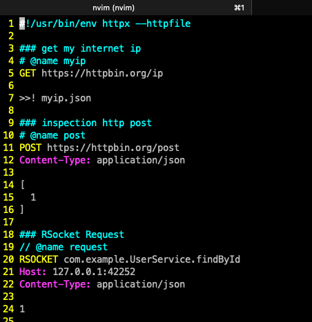

# Neovim Plugin

[Neovim httpx plugin](https://github.com/servicex-sh/httpx.vim) supplies syntax highlight and command to make request call for http file.

### Install

```
git clone https://github.com/httpx-sh/httpx.vim.git ~/.config/nvim/pack/github/start/httpx.vim
```

### How to use?

Open index.http file and move the cursor to a request, then invoke `:Httpx` command.
You can bind keymap with `nnoremap <c-h> :Httpx<CR>` and press `ctrl-h` to make request call.

### Abbreviations

httpx vim plugin with following abbreviations by default, and you can add more customized abbreviations.

```vim
autocmd FileType httpfile :iabbrev <buffer> hget 
\<CR>### http get
\<CR>GET http://httpbin.org/ip

autocmd FileType httpfile :iabbrev <buffer> hpost 
\<CR>### http post
\<CR>POST http://httpbin.org/post
\<CR>Content-Type: application/json
\<CR>
\<CR>
```

### Screenshot



# Neovim RPC testing

To help Neovim users to test Neovim RPC API,  and you can use `NIVM` to test Nvim RPC.

* Start Nvim with RPC service:  `nvim --listen 127.0.0.1:6666`
* Call nvim_comand_name from `NVIM` as following:

```
### nvim request
NVIM nvim_buf_set_lines
Content-Type: application/json

[0, 0, 0, true, ["hello"]]
```

* Test nvim_exec_lua with Lua code:

```
### nvim Lua exec
NVIM nvim_exec_lua
Content-Type: text/x-lua

vim.api.nvim_command('!ls')
```

The default connect server is `127.0.0.1:6666`. If you want to change target server, please add `Host: target_host:6666`.

