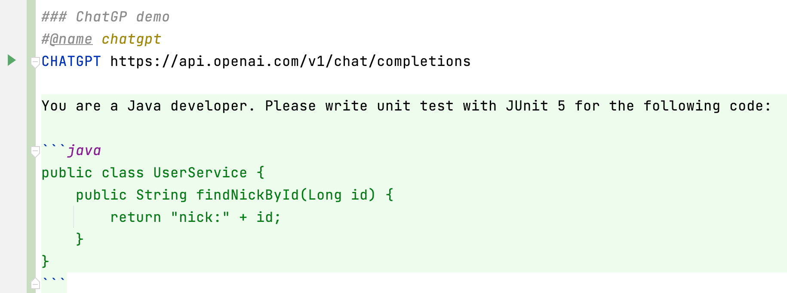
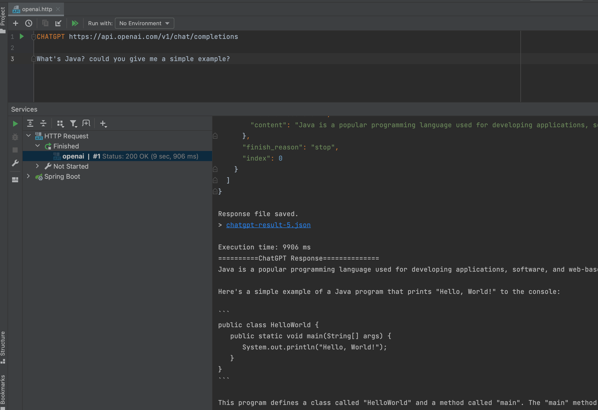

# ChatGPT testing

[ChatGPT](https://chat.openai.com/) is very popular now, and lots of developers use it to assistant their work.
But sometimes it is not easy to input long text with code in chat input box.

With ChatGPT support in httpx, it's easy to write long text with code in http file, and then send it to ChatGPT.
Example as below:

```
### ChatGP demo
#@name chatgpt
CHATGPT https://api.openai.com/v1/chat/completions
X-OPENAI-API-KEY ${OPENAI_API_KEY}

You are a Java developer. Please write unit test with JUnit 5 for the following code:

```java
public class UserService {
    public String findNickById(Long id) {
        return "nick:" + id;
    }
}
```

Markdown format is the default format for ChatGPT query, and you can enjoy the code highlight.



ChatGPT API returns JSON format, and it's not easy to read the answer.
httpx extracts the answer from JSON, and then display it in the bottom, and you can read it easily.



If you want system/assistant message, you can use Markdown attributes `{.system}` or `{.assistant}` to mark paragraph.

```
### ChatGPT with JBang
CHATGPT https://api.openai.com/v1/chat/completions

You are to generate Java code in the style of jbang, and main class must be named Hello. {.system}

Build a CLI app with Picocli 4.7.3 library, and include name and email options. Do not add any additional text.

Please use Java 17. {.assistant}
```

**Tips**: if set `OPENAI_API_KEY` environment variable, you don't need to set `X-OPENAI-API-KEY` HTTP header.
