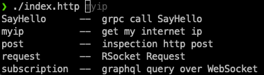

# Miscellaneous

### zsh completion: `httpx --completions zsh`



### request from pipeline

`echo "GET https://httpbin.org/ip" | httpx`

### request body from pipeline

You can overwrite request body from pipeline. For example:

```
### inspection http post
# @name post
POST https://httpbin.org/post
Content-Type: application/json

[ 1 ]
```

Then set request body from pipeline with `echo hello | httpx post`

### default target to run

You can set default target to run by `--target ` option.

```
#!/usr/bin/env httpx --target myip --httpfile

### get my internet ip
# @name myip
GET https://httpbin.org/ip
```

**Attention**: If no target from CLI, and httpx will run first target in http file!
